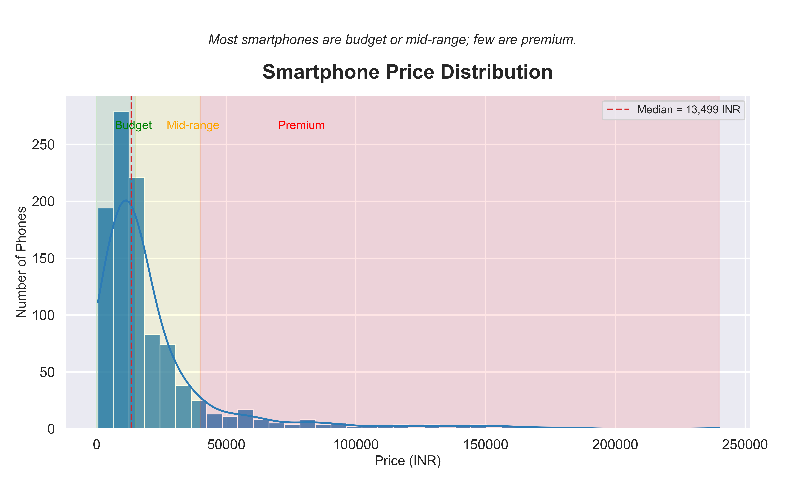

# Smartphone Price Data Visualization

## 📄 Dataset Description
This project analyzes a real-world smartphone dataset with prices and specifications (source: Kaggle). The dataset contains over 1,000 smartphone records, including fields such as brand, price, processor, memory, battery, camera, display, SIM type, and Android version.

**Key columns include:**  
- `name`: Phone name/model  
- `price`: Listed price in INR  
- `processor`, `memory`, `battery`, `camera`, `display`: Device specs  
- `category`: Price band (if provided)  
- `version`: Android version  

## 📊 Visualizations

### Smartphone Price Distribution

- **Budget phones:** INR 0–15,000 (green zone)  
- **Mid-range:** INR 15,001–40,000 (yellow zone)  
- **Premium:** INR 40,001+ (red zone)  
- **Median price:** Approx 13,499 INR

## 💡 Insights & Observations

- The **majority of smartphones (over 70%) fall in the budget segment**, priced below 15,000 INR.  
- The **distribution is right-skewed**: there are a few very expensive, premium models.  
- The **median price** is around 13,499 INR, suggesting most customers trend towards budget or lower-midrange models.  
- Few phones are listed above 40,000 INR, showing limited premium market presence in this dataset.

## 🏁 How to Run

1. Clone this repository.  
